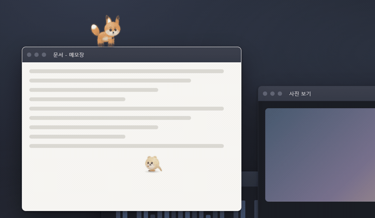
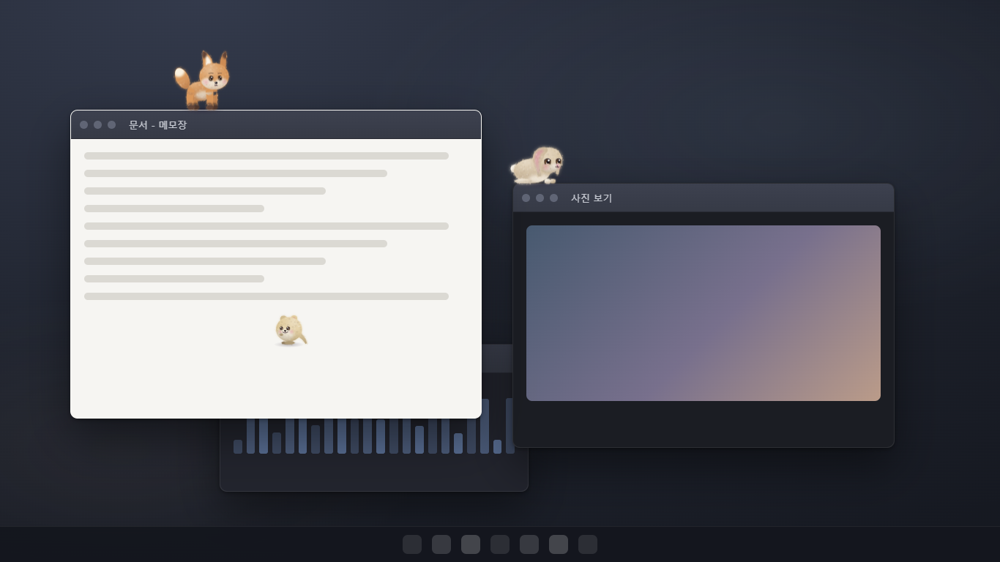
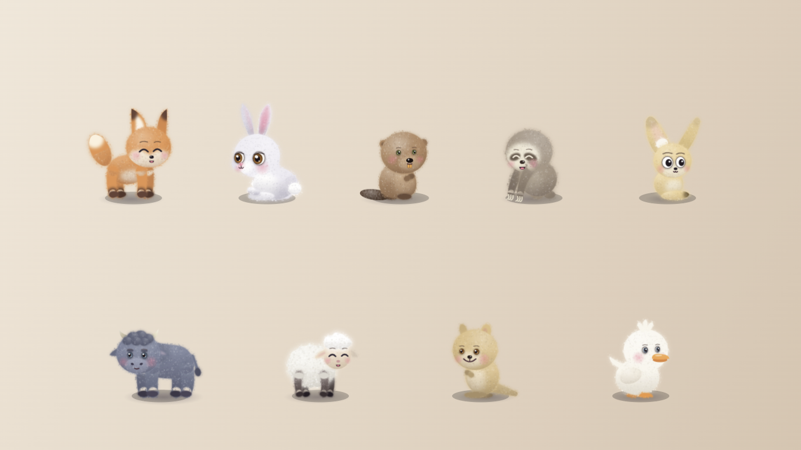
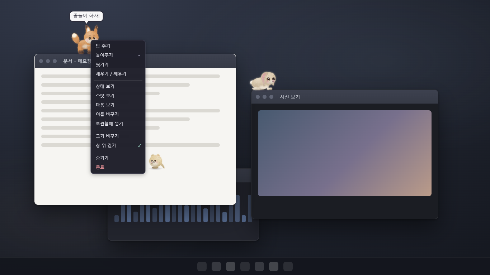
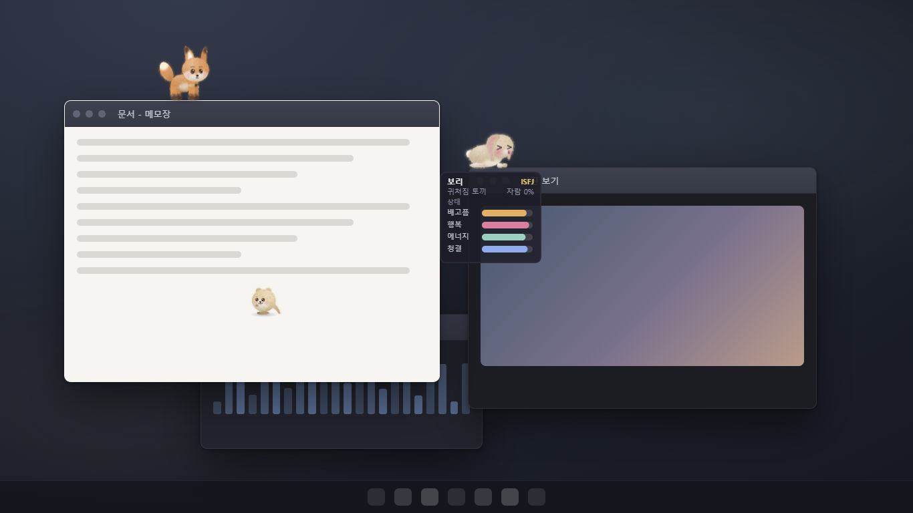
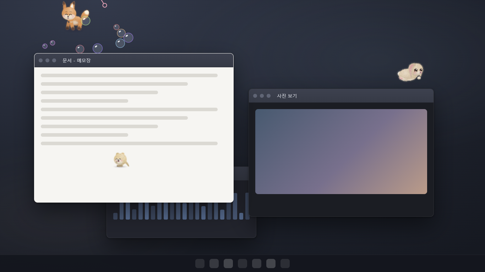
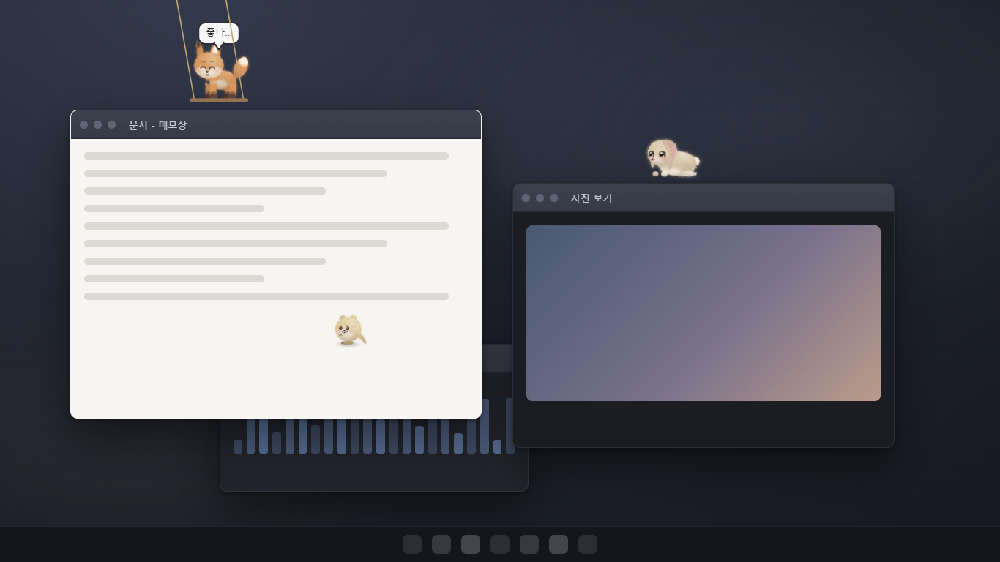

# 다마고치 (Damagoch)

바탕화면 위를 걸어 다니는, 양모 펠트 인형 같은 작은 동물을 키우는 데스크톱 펫.

**[⬇ 최신 버전 내려받기](https://github.com/develckm86/damagoch-releases/releases/latest)** · Windows 10 이상 (64비트) · macOS

## 어떤 앱인가요

열어 둔 창들 위를 걸어 다니는 작은 친구예요. 브라우저 제목 표시줄을 따라 걷다가 끝에서 폴짝 뛰어내리고, 착지할 곳이 없으면 바탕화면까지 떨어지고, 기운이 다하면 선 자리에서 그대로 잠들어요. 창을 옮기면 그 위에 선 채로 같이 따라가요.

캐릭터는 그림 파일이 아니라 코드로 한 획씩 그려요. 펠트의 보풀과 그림자를 그때그때 계산해서, 어느 크기로 키워도 뭉개지지 않아요.

캐릭터 본체와 열린 메뉴 위에서만 마우스가 반응하고, 나머지 클릭은 그대로 뒤쪽 창으로 통과해서 일하는 데 방해가 되지 않아요.

## 아홉 종류의 동물

여우 · 토끼 · 비버 · 나무늘보 · 사막여우 · 물소 · 양 · 쿼카 · 오리. 그림자만 봐도 알아볼 수 있게 자세와 발, 귀, 눈매를 동물마다 따로 그렸어요. 걷는 방식도 달라요. 토끼와 쿼카는 통통 튀고, 나무늘보는 느릿느릿 매달리고, 여우는 가끔 재빠르게 달려 나가고, 물소는 묵직하게 착지해요.

## 성격이 있어요

태어날 때 열여섯 가지 성격 유형 중 하나가 정해져요. 성격에 따라 좋아하는 돌봄(밥 주기 · 놀아주기 · 씻기기 · 쓰다듬기)과 싫어하는 돌봄이 다르고, 발판 끝에서 조심스럽게 돌아서는 아이도, 망설임 없이 다음 창으로 뛰어내리는 아이도 있어요.

## 돌보는 대로 자라요

알에서 태어나 아기 · 어린이 · 어른으로 자라요. 자라는 모습은 미리 정해져 있지 않아요. 무엇을 자주 해 주었는지가 성격 점수로 쌓여 어떤 어른이 될지를 가려요.

## 같이 놀아요

공 던지기 · 강아지풀 · 비눗방울 · 그네 밀기 · 블록 쌓기 · 줄다리기 · 당근 찾기. 장난감을 마우스로 직접 다뤄요. 공은 던진 방향과 세기대로 날아가고, 그네는 미는 때를 맞춰야 하고, 블록은 쌓다 보면 와르르 무너져요. 동물과 성격마다 제일 좋아하는 장난감이 달라요.

| 비눗방울 | 그네 |
|---|---|
|  |  |

## 그 밖에

- **여러 마리** — 여덟 마리까지 키우고 함께 내보낼 수 있어요. 여우는 토끼를 쫓고, 같은 종족끼리는 붙어 있고, 둘이서 공놀이나 술래잡기를 하기도 해요.
- **마을** — 위에서 내려다보는 마을에서 내 캐릭터로 걸어 다니며 밭을 일구고, 곤충을 잡고 낚시를 하고, 다마고치와 함께 놀아요.
- **AI 대사 (선택)** — 켜면 이 컴퓨터 안에서만 도는 AI(약 2.5GB를 한 번 내려받음)가 대사를 새로 만들고, 잠든 사이 꿈을 꾸며 자기 이야기를 스스로 써요.
- **언어** — 한국어 · English · 日本語 · 简体中文 · 繁體中文

## 설치

### Windows

[Releases](https://github.com/develckm86/damagoch-releases/releases/latest) 에서 둘 중 하나를 받아요.

- `Damagoch.Setup.x.y.z.exe` — 설치해서 써요 (시작 메뉴에 들어가요)
- `Damagoch.x.y.z.exe` — 설치 없이 바로 실행해요

처음 실행하면 "Windows의 PC 보호" 창이 뜰 수 있어요 (코드 서명 인증서가 없어서예요). **추가 정보 → 실행** 을 누르면 돼요.

작업 표시줄 오른쪽 트레이 아이콘에서 다마고치를 돌보고, 숨기고, 끌 수 있어요.

### 맥

- Apple Silicon (M1 이후): `Damagoch-x.y.z-arm64.dmg`
- Intel: `Damagoch-x.y.z.dmg`

처음 한 번은 앱을 **우클릭 → 열기** 하거나, **시스템 설정 → 개인정보 보호 및 보안** 에서 *그래도 열기* 를 눌러요. 메뉴 막대 오른쪽 아이콘으로 써요 (Dock 에는 나오지 않아요).
